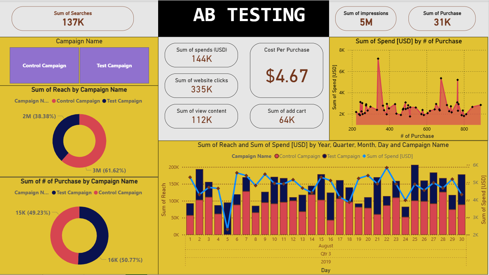

# 📈 Enhanced Digital Marketing Campaigns Through A/B Testing

## 🛠 Tools Used
- **Power BI** – for interactive visualizations and dashboards  
- **Python** – for data analysis and statistical comparison between groups

---

## 📊 Project Overview

This project focuses on enhancing digital marketing campaign performance using an **A/B Testing approach**. The goal was to evaluate the effectiveness of two separate campaigns – a **Control Campaign** and a **Test Campaign** – based on key performance indicators (KPIs) including:

- 📌 **Reach**
- 💵 **Spend**
- 🎯 **Website Clicks**
- 🛒 **Add to Cart**
- 📦 **Purchases**
- 📊 **Cost per Purchase**
- 💡 **Return on Investment (ROI)**

---

## 🔍 KPI Comparison Table

| **Metric**                | **Control Campaign** | **Test Campaign** | **Better Performer**         |
|---------------------------|----------------------|-------------------|------------------------------|
| Searches                  | 64K                  | 73K               | Test Campaign                |
| Impressions               | 3M                   | 2M                | Control Campaign             |
| Reach                     | 3M                   | 2M                | Control Campaign             |
| Spend (USD)              | $67K                 | $77K              | Control Campaign (lower)     |
| Purchases                 | 15K                  | 16K               | Test Campaign (slightly)     |
| Website Clicks            | 154K                 | 181K              | Test Campaign                |
| Add to Cart               | 38K                  | 26K               | Control Campaign             |
| View Content              | 56K                  | 56K               | Equal                        |
| **Cost per Purchase**     | **$4.41**            | **$4.92**         | **Control Campaign**         |

---
## 💰 Cost per Purchase (CPP) Calculation

\[
\text{CPP} = \frac{\text{Campaign Spend}}{\text{Purchases}}
\]

- **Control Campaign**: $67,000 ÷ 15,000 ≈ $4.41 per purchase  
- **Test Campaign**: $77,000 ÷ 16,000 ≈ $4.92 per purchase  

> Lower CPP indicates more cost-efficient campaigns.

---

## 💸 ROI Calculation

Assume **average profit per purchase = $6** for both campaigns.

**Revenue Calculation**:

- **Control Campaign Revenue**:  
  15,000 × (4.41 + 6) = $156,150  

- **Test Campaign Revenue**:  
  16,000 × (4.92 + 6) = $174,720  

**ROI Calculation**:  

ROI (%) = (Revenue − Spend) ÷ Spend × 100  

- **Control Campaign ROI**:  
  (156,150 − 67,000) ÷ 67,000 × 100 ≈ 133.2%  

- **Test Campaign ROI**:  
  (174,720 − 77,000) ÷ 77,000 × 100 ≈ 126.8%  

**Result:**  
The **Control Campaign** is more cost-efficient and delivers higher ROI.

---

📌 The primary goal was to compare the **Control Group** and the **Test Group** across key performance metrics such as:

- 💰 **Cost per Purchase**
- 📣 **Reach**
- 📈 **Return on Investment (ROI)**

---

## ✅ Final Outcome

- The **Control Campaign** was found to be more **cost-effective** and delivered **higher reach**.
- Despite more clicks and purchases in the **Test Campaign**, the **Control Campaign had a lower cost per purchase**, resulting in **better ROI**.
- Thus, the **Control Campaign** is the **recommended choice** for future digital marketing strategies based on data-driven insights.

---

## 📌 Key Takeaways

- 📊 A/B Testing is a powerful method for optimizing marketing performance.
- 📈 Power BI dashboards make complex data insights visually intuitive.
- 🧠 Python allows for deep analysis and validation of campaign outcomes.
- ✅ Informed decisions based on metrics like **ROI** and **cost per conversion** can greatly improve marketing success.

---

## 🚀 In Brief

This project clearly shows how **data-driven A/B testing** combined with powerful tools like Python and Power BI can reveal which campaign strategy works best.  
It empowers marketers to invest in what actually delivers results.

---

## 📷 Dashboard Preview

---
